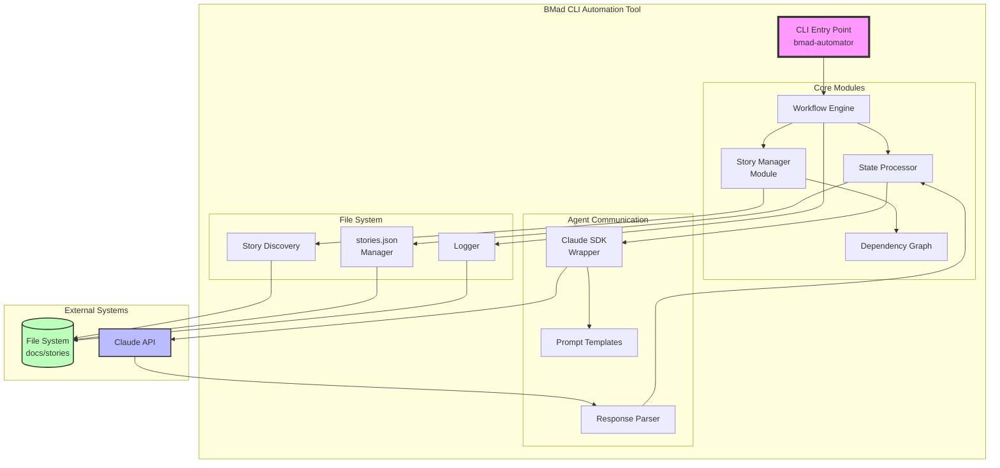
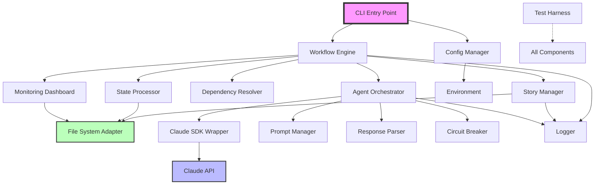
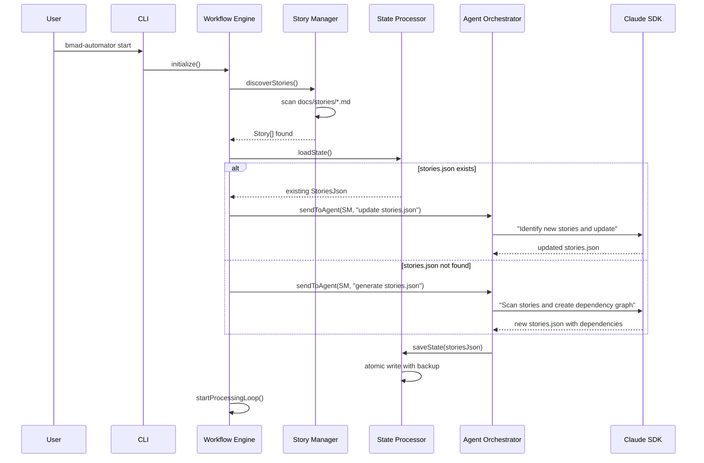
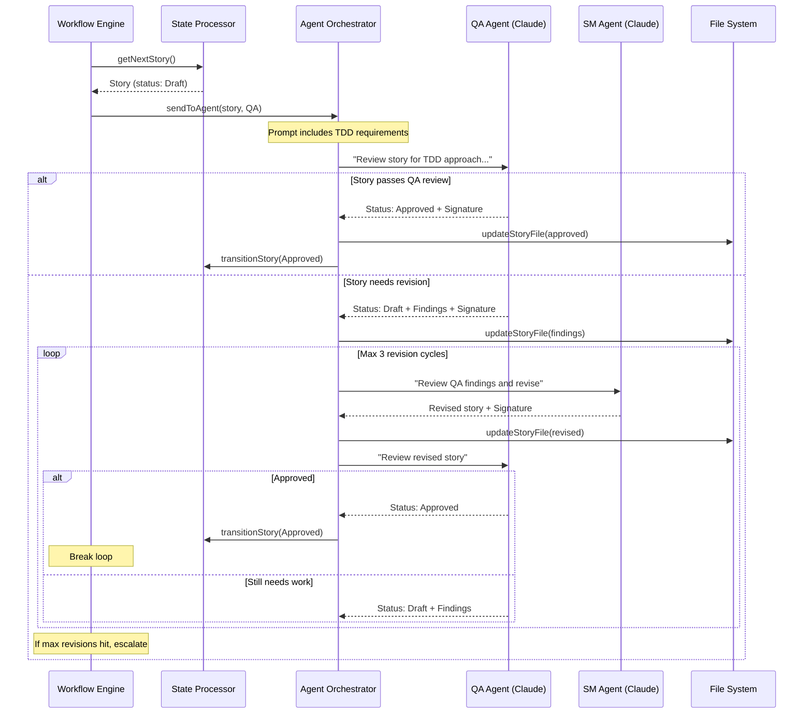
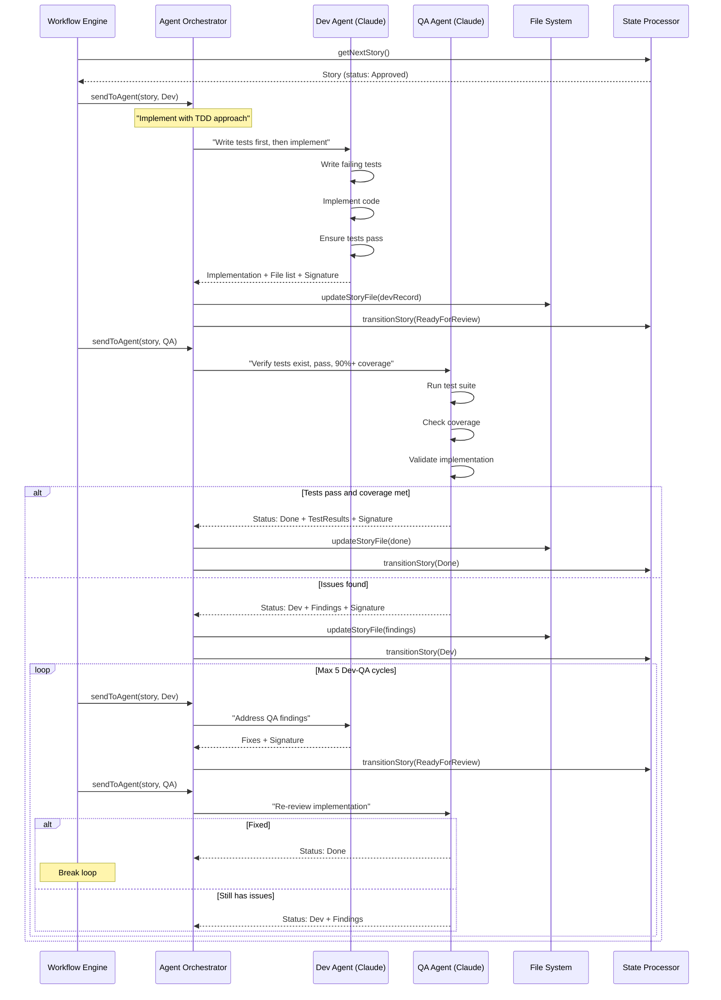
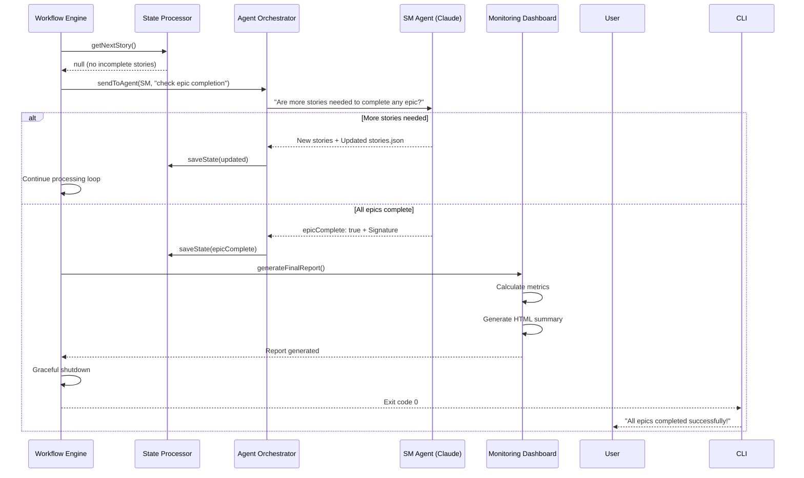
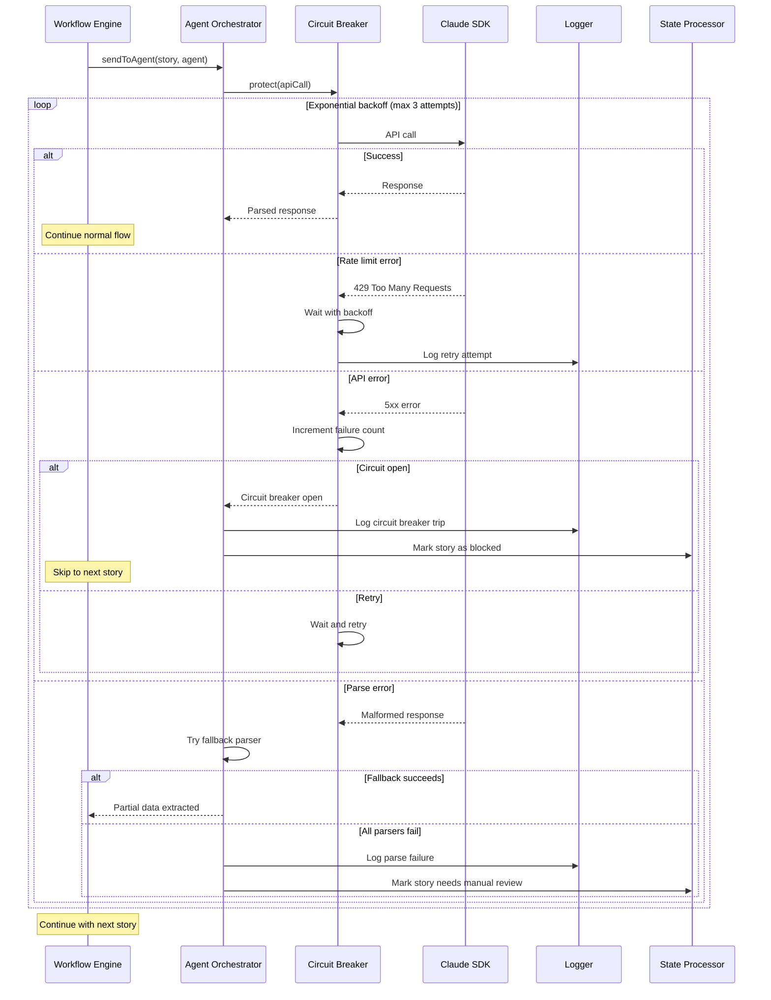

# BMad CLI Automation Tool Architecture Document

## Introduction

This document outlines the overall project architecture for BMad CLI Automation Tool, including backend systems, shared services, and non-UI specific concerns. Its primary goal is to serve as the guiding architectural blueprint for AI-driven development, ensuring consistency and adherence to chosen patterns and technologies.

**Relationship to Frontend Architecture:**
If the project includes a significant user interface, a separate Frontend Architecture Document will detail the frontend-specific design and MUST be used in conjunction with this document. Core technology stack choices documented herein (see "Tech Stack") are definitive for the entire project, including any frontend components.

### Starter Template or Existing Project

After reviewing the PRD and project brief, I can see that this is a greenfield CLI tool project with no mention of any starter templates or existing codebases. The project will be built from scratch as an NPX-distributable TypeScript CLI application.

**Decision:** N/A - No starter template will be used. This is a greenfield CLI project that will be structured as a monorepo TypeScript package designed for NPX distribution.

### Change Log

| Date | Version | Description | Author |
|------|---------|-------------|--------|
| 2025-01-26 | 1.0 | Initial architecture document creation | Winston (Architect) |

## High Level Architecture

### Technical Summary

The BMad CLI Automation Tool employs a monolithic event-driven architecture built on TypeScript and Node.js, orchestrating Claude AI agents through the TypeScript SDK to achieve 24/7 autonomous development. The system uses a state machine pattern to manage story lifecycle transitions, with file-based state persistence via stories.json serving as the single source of truth. Core architectural patterns include dependency injection for testability, repository pattern for file system abstraction, and circuit breakers for resilient agent communication. This architecture directly supports the PRD goals of reducing manual orchestration from 3+ hours to <10 minutes daily while maintaining strict TDD practices with 90% test coverage.

### High Level Overview

1. **Main Architectural Style**: Monolithic CLI Application with Event-Driven internals
   - Single Node.js process orchestrating all operations
   - Event emitters for workflow state changes
   - Plugin-based architecture for future extensibility

2. **Repository Structure**: Monorepo (as specified in PRD)
   - Single repository containing all code
   - NPX-distributable package structure
   - Shared TypeScript configurations

3. **Service Architecture**: Monolithic with Domain-Driven modules
   - Core domain: Story lifecycle management
   - Agent communication module
   - File system operations module
   - State management module

4. **Primary Data Flow**:
   - Stories discovered from `docs/stories` directory
   - State machine processes stories by priority (Ready For Review → Dev → Approved → Draft)
   - Claude SDK facilitates agent interactions
   - stories.json persists state between runs
   - Graceful exit when all epics complete

5. **Key Architectural Decisions**:
   - **File-based state over database**: Simplifies deployment and aligns with developer workflows
   - **Sequential processing**: Ensures focus and prevents context switching for AI agents
   - **Event-driven internals**: Enables future parallel processing without major refactoring
   - **TypeScript SDK over CLI**: Better error handling and streaming responses

### High Level Project Diagram



### Architectural and Design Patterns

- **State Machine Pattern:** Managing story lifecycle transitions (Draft → Approved → Dev → Ready For Review → Done) - _Rationale:_ Enforces valid state transitions and provides clear workflow boundaries essential for agent handoffs

- **Repository Pattern:** Abstracting file system operations for stories and state persistence - _Rationale:_ Enables comprehensive testing with mock file systems and future migration flexibility

- **Circuit Breaker Pattern:** Protecting against Claude API failures and infinite retry loops - _Rationale:_ Prevents system lockup during API outages and manages retry attempts with exponential backoff

- **Observer Pattern:** Event-driven workflow state changes and progress notifications - _Rationale:_ Decouples workflow steps and enables future parallel processing capabilities

- **Command Pattern:** Encapsulating agent instructions with required parameters - _Rationale:_ Ensures consistent agent communication and enables dry-run testing mode

- **Dependency Injection:** Wiring components with interfaces rather than concrete implementations - _Rationale:_ Critical for achieving 90% test coverage requirement through comprehensive mocking

- **Template Method Pattern:** Standardizing agent prompt generation with variable substitution - _Rationale:_ Maintains consistency across agent types while allowing customization

## Tech Stack

This is the DEFINITIVE technology selection section. These choices will guide all implementation decisions throughout the project.

### Cloud Infrastructure

- **Provider:** N/A - This is a client-side CLI tool
- **Key Services:** None - Runs locally on developer machines
- **Deployment Regions:** NPM Registry (global distribution)

### Technology Stack Table

| Category | Technology | Version | Purpose | Rationale |
|----------|------------|---------|---------|-----------|
| **Language** | TypeScript | 5.9.2 | Primary development language | Latest stable (Jan 2025), strong typing for reliability, Go port coming in v7 |
| **Runtime** | Node.js | 22.11.0 | JavaScript runtime | Latest LTS (Active until Oct 2025), native fetch, stable performance |
| **Package Manager** | pnpm | 9.15.0 | Monorepo package management | Excellent workspace support, fast installs, content-addressable storage |
| **AI SDK** | @anthropic-ai/sdk | 0.57.0 | Agent communication | Official SDK, better error handling than CLI, streaming support |
| **CLI Framework** | Commander.js | 14.0.0 | Command-line interface | Latest version, requires Node 20+, excellent TypeScript support |
| **State Validation** | Zod | 4.0.14 | Runtime validation | Latest v4 (57% smaller bundle), 10x faster compilation, type-safe schemas |
| **File Watching** | Chokidar | 3.6.0 | Cross-platform file monitoring | Reliable, handles edge cases, good performance |
| **Logging** | Winston | 3.17.0 | Structured logging | Latest stable, flexible transports, JSON format, log rotation |
| **Testing Framework** | Jest | 30.0.5 | Unit and integration testing | Latest v30, requires TypeScript 5.4+, faster & leaner |
| **Test Utilities** | ts-jest | 29.4.0 | TypeScript support for Jest | Note: May need update for Jest 30 compatibility |
| **Mocking** | jest-mock-extended | 3.0.7 | Type-safe mocking | Better TypeScript mocking experience |
| **Build Tool** | ESBuild | 0.25.8 | Bundling for NPX | Latest version, 10-100x faster than alternatives |
| **Linting** | ESLint | 9.17.0 | Code quality enforcement | Latest major version with flat config support |
| **Formatting** | Prettier | 3.4.2 | Code formatting | Latest stable, consistent style |
| **Git Hooks** | Husky | 9.2.0 | Pre-commit hooks | Latest version, ensures tests pass before commit |
| **Commit Linting** | Commitlint | 19.6.0 | Commit message standards | Enforces conventional commits |
| **Schema Types** | type-fest | 4.36.0 | Advanced TypeScript types | Utility types for complex scenarios |
| **Date Handling** | date-fns | 3.6.0 | Date manipulation | Lightweight, functional, tree-shakeable |
| **Process Management** | Execa | 9.5.2 | Child process execution | Latest version, Promise-based, better than native |
| **Type Definitions** | @types/jest | 30.0.0 | Jest TypeScript types | Matches Jest 30 for full type safety |

**⚠️ IMPORTANT: This technology stack is the single source of truth for the entire project. All implementation must use these exact versions and technologies.**

## Data Models

Based on the story template and PRD requirements, here are the core data models:

### Story

**Purpose:** Represents an individual development story with its lifecycle state, dependencies, and multi-agent collaboration

**Key Attributes:**
- filename: string - Story filename (e.g., "1.1.setup-auth.md")
- epicNum: string - Epic number (e.g., "1")
- storyNum: string - Story number within epic (e.g., "1")
- storyTitleShort: string - Short title for filename (e.g., "setup-auth")
- status: StoryStatus - Current state (Draft, Approved, InProgress, Review, Done)
- story: StoryDefinition - User story with role, action, benefit
- acceptanceCriteria: string[] - Numbered list from epic
- tasksSubtasks: TaskItem[] - Breakdown with checkboxes
- devNotes: DevNotes - Architecture context for dev agent
- changeLog: ChangeLogEntry[] - Document version history
- devAgentRecord: DevAgentRecord | null - Dev completion details
- qaResults: QAResults | null - QA review findings
- dependencies: string[] - Other story filenames this depends on
- ownerSections: Record<string, string> - Section ownership mapping
- editorSections: Record<string, string[]> - Section edit permissions

**Relationships:**
- Belongs to one Epic
- Has many ChangeLogEntries
- Has one DevAgentRecord (when developed)
- Has one QAResults (when reviewed)

### StoryDefinition

**Purpose:** Structured user story format with role, action, and benefit

**Key Attributes:**
- role: string - User role (e.g., "developer", "BMad team member")
- action: string - What they want to do
- benefit: string - Why they want to do it

**Relationships:**
- Belongs to one Story

### TaskItem

**Purpose:** Hierarchical task breakdown with completion tracking

**Key Attributes:**
- id: string - Task identifier
- description: string - Task description
- completed: boolean - Checkbox state
- acceptanceCriteriaRef: number | null - Links to AC number
- subtasks: TaskItem[] - Nested subtasks
- owner: string - Who's responsible (usually dev-agent)

**Relationships:**
- Belongs to one Story
- Can have many Subtasks (self-referential)

### DevNotes

**Purpose:** Extracted architecture context to prevent dev agent from reading full docs

**Key Attributes:**
- relevantSourceTree: string[] - File paths relevant to story
- previousStoryNotes: string[] - Context from related stories
- architectureContext: string - Key architectural decisions
- testingStandards: TestingStandards - Test requirements

**Relationships:**
- Belongs to one Story

### TestingStandards

**Purpose:** Story-specific testing requirements extracted from architecture

**Key Attributes:**
- testFileLocation: string - Where tests should be placed
- testStandards: string[] - Standards to follow
- frameworks: string[] - Testing frameworks to use
- specificRequirements: string[] - Story-specific test needs

**Relationships:**
- Belongs to DevNotes

### ChangeLogEntry

**Purpose:** Track all modifications to story documents

**Key Attributes:**
- date: Date - When changed
- version: string - Document version
- description: string - What changed
- author: string - Agent or human who made change

**Relationships:**
- Belongs to one Story

### DevAgentRecord

**Purpose:** Development agent's implementation record

**Key Attributes:**
- agentModelUsed: string - AI model name and version
- debugLogReferences: string[] - Log locations
- completionNotes: string[] - Implementation notes
- fileList: FileChange[] - All files touched
- timestamp: Date - When completed
- signature: string - Dev agent signature

**Relationships:**
- Belongs to one Story
- Has many FileChanges

### FileChange

**Purpose:** Track files modified during story implementation

**Key Attributes:**
- path: string - File path
- action: string - Created, Modified, Deleted
- description: string - What was changed

**Relationships:**
- Belongs to DevAgentRecord

### QAResults

**Purpose:** QA agent's review findings and approval status

**Key Attributes:**
- status: string - Pass, Fail, NeedsWork
- findings: Finding[] - Issues found
- testResults: TestResult[] - Test execution results
- coverage: number - Test coverage percentage
- timestamp: Date - When reviewed
- signature: string - QA agent signature

**Relationships:**
- Belongs to one Story
- Has many Findings
- Has many TestResults

### Finding

**Purpose:** QA-identified issues requiring resolution

**Key Attributes:**
- severity: string - Critical, Major, Minor
- category: string - Bug, TestMissing, StandardViolation
- description: string - What's wrong
- location: string | null - File:line reference
- suggestedFix: string - How to fix it

**Relationships:**
- Belongs to QAResults

### StoriesJson

**Purpose:** Persistent state maintaining story processing order and status

**Key Attributes:**
- stories: Record<string, StoryMetadata> - Map of filenames to metadata
- executionOrder: string[] - SM-determined processing order
- epicComplete: boolean - All epics done flag
- lastUpdated: Date - File modification time
- signatures: AgentSignature[] - SM signatures for updates

**Relationships:**
- References all Stories
- Has many AgentSignatures

### AgentSignature

**Purpose:** Cryptographic-style signature for agent actions

**Key Attributes:**
- agentId: string - SM, Dev, or QA
- action: string - What was done
- timestamp: Date - When it happened
- hash: string - Content hash for integrity

**Relationships:**
- Used by multiple entities (Story, StoriesJson, etc.)

## Components

Based on the architectural patterns, tech stack, and data models, here are the major logical components:

### CLI Entry Point
**Responsibility:** Parse command-line arguments, initialize system, handle graceful shutdown

**Key Interfaces:**
- `bmad-automator start` - Begin automation with optional flags
- `bmad-automator status` - Check current automation state
- `bmad-automator stop` - Graceful shutdown
- `--dry-run` - Preview actions without execution
- `--config <path>` - Custom configuration file

**Dependencies:** Commander.js, ConfigManager, WorkflowEngine

**Technology Stack:** TypeScript, Commander.js 14.0.0, Node.js 22.11.0

### Workflow Engine
**Responsibility:** Orchestrate story processing flow, manage state transitions, enforce sequential processing

**Key Interfaces:**
- `startAutomation(): Promise<void>` - Main automation loop
- `processNextStory(): Promise<StoryResult>` - Get and process next story
- `handleStoryCompletion(story: Story): void` - Update state after completion
- `checkEpicCompletion(): Promise<boolean>` - Verify if all epics done

**Dependencies:** StoryManager, StateProcessor, DependencyResolver, AgentOrchestrator

**Technology Stack:** TypeScript with event emitters for state changes, async/await patterns

### Story Manager
**Responsibility:** Discover story files, parse YAML frontmatter, manage story lifecycle

**Key Interfaces:**
- `discoverStories(): Promise<Story[]>` - Scan docs/stories directory
- `parseStoryFile(path: string): Promise<Story>` - Extract structured data
- `updateStoryFile(story: Story): Promise<void>` - Write changes back
- `validateStory(story: Story): ValidationResult` - Ensure story integrity

**Dependencies:** FileSystemAdapter, YAMLParser, StoryValidator

**Technology Stack:** TypeScript, Chokidar 3.6.0 for file watching, custom YAML parser

### State Processor
**Responsibility:** Manage stories.json, enforce state machine rules, track execution order

**Key Interfaces:**
- `loadState(): Promise<StoriesJson>` - Read current state
- `saveState(state: StoriesJson): Promise<void>` - Atomic write with backup
- `transitionStory(story: string, newStatus: StoryStatus): void` - State change
- `getNextStory(): Story | null` - Priority-based selection

**Dependencies:** FileSystemAdapter, StateValidator, AtomicFileWriter

**Technology Stack:** TypeScript, Zod 4.0.14 for validation, atomic file operations

### Dependency Resolver
**Responsibility:** Build dependency graph, detect circular dependencies, determine execution order

**Key Interfaces:**
- `buildDependencyGraph(stories: Story[]): DependencyGraph` - Create graph
- `detectCycles(): string[][]` - Find circular dependencies
- `getExecutionOrder(): string[]` - Topological sort
- `canExecute(story: Story): boolean` - Check if dependencies met

**Dependencies:** Graph algorithms library (internal)

**Technology Stack:** TypeScript, custom graph implementation

### Agent Orchestrator
**Responsibility:** Manage Claude SDK interactions, route stories to appropriate agents, handle retries

**Key Interfaces:**
- `sendToAgent(story: Story, agentType: AgentType): Promise<AgentResponse>`
- `parseAgentResponse(response: string): ParsedResponse`
- `retryWithBackoff(fn: Function): Promise<any>`
- `getAgentPrompt(story: Story, agent: AgentType): string`

**Dependencies:** ClaudeSDKWrapper, PromptManager, ResponseParser, CircuitBreaker

**Technology Stack:** TypeScript, @anthropic-ai/sdk 0.57.0

### Claude SDK Wrapper
**Responsibility:** Abstract Claude API interactions, manage conversations, handle streaming

**Key Interfaces:**
- `createConversation(): Conversation` - New agent session
- `sendMessage(prompt: string): Promise<Response>` - Send to Claude
- `streamResponse(onChunk: Function): void` - Handle streaming
- `handleRateLimit(): void` - Backoff strategy

**Dependencies:** @anthropic-ai/sdk

**Technology Stack:** TypeScript, official Anthropic SDK with custom error handling

### Prompt Manager
**Responsibility:** Generate agent-specific prompts, inject story context, ensure parseable responses

**Key Interfaces:**
- `getPromptTemplate(agent: AgentType): PromptTemplate`
- `buildPrompt(template: PromptTemplate, story: Story): string`
- `injectResponseFormat(prompt: string): string` - Add format requirements
- `addTDDRequirements(prompt: string): string` - Enforce TDD

**Dependencies:** Template engine (internal)

**Technology Stack:** TypeScript, template literals with validation

### Response Parser
**Responsibility:** Extract structured data from agent responses, handle malformed responses

**Key Interfaces:**
- `parseStatus(response: string): StoryStatus | null`
- `parseSignature(response: string): AgentSignature | null`
- `parseFindings(response: string): Finding[]`
- `fallbackParse(response: string): ParsedResponse` - Regex fallback

**Dependencies:** Natural language parsing utilities

**Technology Stack:** TypeScript, multiple parsing strategies

### File System Adapter
**Responsibility:** Abstract file operations, ensure atomic writes, manage locks

**Key Interfaces:**
- `readFile(path: string): Promise<string>`
- `writeFileAtomic(path: string, content: string): Promise<void>`
- `watchDirectory(path: string, callback: Function): void`
- `acquireLock(file: string): Promise<Lock>`

**Dependencies:** Node.js fs, Chokidar

**Technology Stack:** TypeScript, Node.js fs.promises, lock files

### Logger
**Responsibility:** Structured logging, log rotation, performance metrics

**Key Interfaces:**
- `info(message: string, meta?: object): void`
- `error(error: Error, context?: object): void`
- `metric(name: string, value: number): void`
- `createChildLogger(context: object): Logger`

**Dependencies:** Winston

**Technology Stack:** Winston 3.17.0 with JSON format, daily rotation

### Configuration Manager
**Responsibility:** Load configuration, manage environment variables, validate settings

**Key Interfaces:**
- `loadConfig(path?: string): Config`
- `validateConfig(config: unknown): Config`
- `getApiKey(): string` - Secure retrieval
- `getFeatureFlags(): FeatureFlags`

**Dependencies:** Zod, dotenv

**Technology Stack:** TypeScript, Zod validation, environment variables

### Test Harness
**Responsibility:** Provide comprehensive testing utilities for TDD approach

**Key Interfaces:**
- `mockClaudeResponse(response: string): void`
- `createTestStory(overrides?: Partial<Story>): Story`
- `runIntegrationTest(scenario: TestScenario): TestResult`
- `generateCoverageReport(): CoverageReport`

**Dependencies:** Jest, jest-mock-extended

**Technology Stack:** Jest 30.0.5, ts-jest, mock adapters

### Circuit Breaker
**Responsibility:** Prevent cascade failures, implement retry logic, handle backoff

**Key Interfaces:**
- `protect<T>(fn: () => Promise<T>): Promise<T>` - Wrap calls
- `trip(): void` - Open circuit
- `reset(): void` - Close circuit
- `getState(): CircuitState` - Current state

**Dependencies:** None (self-contained)

**Technology Stack:** TypeScript, exponential backoff algorithm

### Monitoring Dashboard Generator
**Responsibility:** Create morning summary reports, track metrics, visualize progress

**Key Interfaces:**
- `generateDailyReport(): Report` - Morning summary
- `trackStoryCompletion(story: Story): void` - Metrics
- `exportHTML(): string` - Visual dashboard
- `calculateVelocity(): number` - Stories/day

**Dependencies:** Template engine, date-fns

**Technology Stack:** TypeScript, HTML templates, date-fns 3.6.0

### Component Interaction Diagram



## External APIs

Based on the PRD requirements and component design, this project uses the Claude TypeScript SDK for all AI agent interactions. No direct API integration is needed since we're using the official SDK.

**No external APIs require manual integration.** All AI agent communication is handled through the @anthropic-ai/sdk package, which abstracts the API details.

## Core Workflows

These sequence diagrams illustrate the key system workflows for the BMad CLI Automation Tool:

### 1. System Initialization and Story Discovery



### 2. Story Approval Workflow (Draft → Approved)



### 3. Development and Testing Workflow (Approved → Done)



### 4. Epic Completion Detection Workflow



### 5. Error Recovery Workflow



## REST API Spec

The BMad CLI Automation Tool does not include a REST API as it is designed as a command-line interface tool that operates locally. All interactions are through CLI commands and file system operations.

**No REST API specification is needed for this project.**

## Database Schema

The BMad CLI Automation Tool uses file-based state management with these essential schemas:

### stories.json Schema

```typescript
interface StoriesJson {
  stories: Record<string, StoryMetadata>;
  executionOrder: string[];
  epicComplete: boolean;
  lastUpdated: string; // ISO date
}

interface StoryMetadata {
  filename: string;
  status: "Draft" | "Approved" | "InProgress" | "Review" | "Done";
  dependencies: string[];
  epicId: string;
}
```

### Story File YAML Frontmatter Schema

```yaml
---
status: Draft | Approved | InProgress | Review | Done
epic_num: string
story_num: string
story_title_short: string
dependencies: string[] # other story filenames
---
```

### Configuration Schema (.bmad-automator.json)

```typescript
interface Config {
  apiKey: string; // environment variable name
  storiesPath: string; // default: "docs/stories"
  retryLimit: number; // default: 3
  agentTimeout: number; // ms, default: 120000
}
```

### Log File Schema (simple text format)

Standard Winston text logs with timestamps, levels, and messages. No complex JSON structure needed for MVP.

**File Organization:**
```
project-root/
├── stories.json                    # Main state file
├── .bmad-automator.json           # Configuration
├── docs/stories/                  # Story markdown files
│   ├── 1.1.setup-auth.md
│   └── 1.2.user-profile.md
└── logs/                          # Simple log files
    └── automator.log
```

## Source Tree

Based on the monorepo structure, TypeScript/Node.js stack, and NPX distribution requirements, here's the project folder structure:

```plaintext
bmad-dev-qa-automator/
├── src/
│   ├── index.ts                       # CLI entry point
│   ├── commands/
│   │   ├── start.ts                   # Main automation command
│   │   ├── status.ts                  # Check current state
│   │   └── stop.ts                    # Graceful shutdown
│   ├── core/
│   │   ├── workflow-engine.ts         # Main orchestration logic
│   │   ├── state-processor.ts         # stories.json management
│   │   ├── dependency-resolver.ts     # Story dependency graph
│   │   └── story-manager.ts           # Story file operations
│   ├── agents/
│   │   ├── agent-orchestrator.ts      # Agent routing and retry
│   │   ├── claude-wrapper.ts          # Claude SDK abstraction
│   │   ├── prompt-manager.ts          # Agent prompt templates
│   │   └── response-parser.ts         # Parse agent responses
│   ├── models/
│   │   ├── story.ts                   # Story interfaces
│   │   ├── agent.ts                   # Agent types
│   │   ├── state.ts                   # State interfaces
│   │   └── config.ts                  # Configuration types
│   ├── utils/
│   │   ├── file-system.ts            # File operations
│   │   ├── logger.ts                  # Winston logger setup
│   │   ├── circuit-breaker.ts        # Retry logic
│   │   └── validators.ts              # Zod schemas
│   └── config/
│       ├── default.ts                 # Default configuration
│       └── prompts/
│           ├── sm-prompts.ts          # Story Manager templates
│           ├── dev-prompts.ts         # Developer templates
│           └── qa-prompts.ts          # QA templates
├── tests/
│   ├── unit/
│   │   ├── core/
│   │   │   ├── workflow-engine.test.ts
│   │   │   ├── state-processor.test.ts
│   │   │   ├── dependency-resolver.test.ts
│   │   │   └── story-manager.test.ts
│   │   ├── agents/
│   │   │   ├── agent-orchestrator.test.ts
│   │   │   ├── prompt-manager.test.ts
│   │   │   └── response-parser.test.ts
│   │   └── utils/
│   │       ├── file-system.test.ts
│   │       └── circuit-breaker.test.ts
│   ├── integration/
│   │   ├── workflow.test.ts           # End-to-end workflow tests
│   │   ├── agent-handoff.test.ts      # Agent transition tests
│   │   └── state-persistence.test.ts  # stories.json tests
│   ├── fixtures/
│   │   ├── stories/
│   │   │   ├── valid-story.md         # Test story files
│   │   │   ├── invalid-story.md
│   │   │   └── complex-deps.md
│   │   ├── responses/
│   │   │   ├── sm-response.txt        # Mock agent responses
│   │   │   ├── dev-response.txt
│   │   │   └── qa-response.txt
│   │   └── stories.json               # Test state file
│   └── test-utils/
│       ├── mock-claude.ts             # Claude SDK mocks
│       ├── test-builders.ts           # Test data builders
│       └── assertions.ts              # Custom assertions
├── docs/
│   ├── prd.md                         # Product Requirements
│   ├── brief.md                       # Project Brief
│   ├── architecture.md                # This document
│   └── stories/                       # Story files (created by SM)
│       ├── 1.1.project-setup.md
│       └── 1.2.story-discovery.md
├── scripts/
│   ├── build.ts                       # Build for NPX
│   ├── release.ts                     # NPM publish script
│   └── dev.ts                         # Development runner
├── dist/                              # Built output (gitignored)
│   ├── index.js                       # Bundled CLI
│   └── index.d.ts                     # Type definitions
├── logs/                              # Runtime logs (gitignored)
│   └── automator.log
├── .github/
│   └── workflows/
│       └── ci.yml                     # GitHub Actions CI
├── package.json                       # NPM package definition
├── tsconfig.json                      # TypeScript configuration
├── tsconfig.build.json               # Build-specific TS config
├── jest.config.js                     # Jest configuration
├── .eslintrc.js                      # ESLint rules
├── .prettierrc                       # Prettier formatting
├── .gitignore                         # Git ignore rules
├── .npmignore                         # NPM publish ignore
├── .env.example                      # Environment variables template
├── .bmad-automator.json              # Default configuration
├── stories.json                       # State file (gitignored)
└── README.md                          # Project documentation
```

**NPX Distribution Structure:**
```json
{
  "name": "bmad-automator",
  "version": "1.0.0",
  "bin": {
    "bmad-automator": "./dist/index.js"
  },
  "files": [
    "dist",
    "README.md"
  ]
}
```

## Infrastructure and Deployment

### Infrastructure as Code

- **Tool:** N/A - Client-side CLI tool
- **Location:** N/A
- **Approach:** No cloud infrastructure required

### Deployment Strategy

- **Strategy:** NPM Package Publishing
- **CI/CD Platform:** GitHub Actions
- **Pipeline Configuration:** `.github/workflows/ci.yml` and `.github/workflows/release.yml`

### Environments

- **Development:** Local development environment with hot reload via ts-node
- **Testing:** Automated testing in CI pipeline before publishing
- **Production:** NPM Registry for global distribution

### Environment Promotion Flow

```text
Local Development → GitHub PR → CI Tests → Merge to main → Release Tag → NPM Publish
     ↓                  ↓            ↓            ↓              ↓            ↓
  npm run dev      Run tests    All pass    Approved      v1.0.0      npm install -g
```

### Rollback Strategy

- **Primary Method:** NPM version rollback (`npm install bmad-automator@previous-version`)
- **Trigger Conditions:** Critical bugs reported, test failures post-release
- **Recovery Time Objective:** < 5 minutes (immediate via NPM)

## Error Handling Strategy

### General Approach

- **Error Model:** Hierarchical error classes with specific error codes
- **Exception Hierarchy:** BaseError → DomainError → SpecificErrors
- **Error Propagation:** Bubble up with context, handle at workflow level

### Logging Standards

- **Library:** Winston 3.17.0
- **Format:** JSON structured logs with timestamp, level, and context
- **Levels:** debug, info, warn, error
- **Required Context:**
  - Correlation ID: UUID per automation run
  - Service Context: Component name and method
  - User Context: Story being processed (no PII)

### Error Handling Patterns

#### External API Errors

- **Retry Policy:** Exponential backoff with jitter (1s, 2s, 4s)
- **Circuit Breaker:** Open after 3 consecutive failures, test after 30s
- **Timeout Configuration:** 120s for agent responses
- **Error Translation:** Map Claude SDK errors to user-friendly messages

#### Business Logic Errors

- **Custom Exceptions:** 
  - `StoryValidationError` - Invalid story format
  - `DependencyError` - Circular or missing dependencies
  - `StateTransitionError` - Invalid status change
- **User-Facing Errors:** Clear messages with resolution steps
- **Error Codes:** BMD-001 through BMD-999 for categorization

#### Data Consistency

- **Transaction Strategy:** Atomic file writes for stories.json
- **Compensation Logic:** Revert story status on partial failure
- **Idempotency:** Re-running same command produces same result

## Coding Standards

These standards are MANDATORY for AI agents generating code for this project.

### Core Standards

- **Languages & Runtimes:** TypeScript 5.9.2, Node.js 22.11.0 LTS
- **Style & Linting:** ESLint 9.17.0 with standard config, Prettier 3.4.2 for formatting
- **Test Organization:** Mirror structure - `src/module.ts` → `tests/unit/module.test.ts`

### Naming Conventions

| Element | Convention | Example |
|---------|------------|---------|
| Files | kebab-case | `story-manager.ts` |
| Classes | PascalCase | `StoryManager` |
| Interfaces | PascalCase with I prefix | `IStoryManager` |
| Functions | camelCase | `parseStoryFile()` |
| Constants | UPPER_SNAKE_CASE | `MAX_RETRIES` |
| Test files | .test.ts suffix | `story-manager.test.ts` |

### Critical Rules

- **Never use console.log:** Always use logger instance - `this.logger.info()` or `logger.error()`
- **All async functions must have error handling:** Wrap in try/catch or use .catch()
- **File operations must use atomic writes:** Use `writeFileAtomic()` from utils, never direct fs.writeFile
- **Agent prompts must include response format:** Always append response format requirements to prompts
- **Tests must be written BEFORE implementation:** TDD is mandatory - test file must exist with failing tests
- **All public methods need JSDoc comments:** Include @param, @returns, @throws
- **Status transitions only through StateProcessor:** Never modify story status directly
- **Dependencies must be validated:** Check for circular dependencies before saving
- **Parse errors need fallback strategies:** Always have at least regex fallback for agent responses

### TypeScript Specifics

- **Strict mode required:** tsconfig must have `"strict": true`
- **No any types:** Use `unknown` and narrow types, or define proper interfaces
- **Prefer const assertions:** Use `as const` for literal types
- **Explicit return types:** All public methods must declare return types
- **Null checks required:** Use optional chaining `?.` and nullish coalescing `??`

## Test Strategy and Standards

### Testing Philosophy

- **Approach:** Strict Test-Driven Development (TDD) - tests must exist before implementation
- **Coverage Goals:** 90% minimum across all files (enforced in CI)
- **Test Pyramid:** 70% unit tests, 20% integration tests, 10% end-to-end tests

### Test Types and Organization

#### Unit Tests

- **Framework:** Jest 30.0.5
- **File Convention:** `{module}.test.ts` in parallel test directory
- **Location:** `tests/unit/` mirroring `src/` structure
- **Mocking Library:** jest-mock-extended 3.0.7
- **Coverage Requirement:** 95% for core modules, 90% for utilities

**AI Agent Requirements:**
- Generate tests for all public methods
- Cover edge cases and error conditions
- Follow AAA pattern (Arrange, Act, Assert)
- Mock all external dependencies

#### Integration Tests

- **Scope:** Component interactions, file system operations, state persistence
- **Location:** `tests/integration/`
- **Test Infrastructure:**
  - **File System:** Use temp directories with real file operations
  - **Claude SDK:** Mock at SDK level, not HTTP level
  - **State Management:** Test full read-write cycles

#### End-to-End Tests

- **Framework:** Jest with full system execution
- **Scope:** Complete automation cycles with mock agents
- **Environment:** Isolated test environment with fixture files
- **Test Data:** Predefined stories in `tests/fixtures/`

### Test Data Management

- **Strategy:** Builder pattern for test data creation
- **Fixtures:** `tests/fixtures/` with valid, invalid, and edge case examples
- **Factories:** Test data builders in `tests/test-utils/test-builders.ts`
- **Cleanup:** Automatic cleanup of temp files after each test

### Continuous Testing

- **CI Integration:** 
  - Pre-commit: Run related tests only
  - PR: Full test suite with coverage report
  - Main branch: Full suite + integration tests
- **Performance Tests:** Benchmark critical paths (dependency resolution, file parsing)
- **Security Tests:** Validate no API keys in logs, sanitized error messages

### Coverage Requirements by Module

| Module | Required Coverage |
|--------|------------------|
| Core (workflow, state) | 95% |
| Agents | 90% |
| Utils | 90% |
| Models | 85% |
| Config | 80% |

## Security

### Input Validation

- **Validation Library:** Zod 4.0.14 for runtime type checking
- **Validation Location:** At all entry points - CLI commands, file parsing, agent responses
- **Required Rules:**
  - All external inputs MUST be validated
  - Validation at API boundary before processing
  - Whitelist approach preferred over blacklist

### Authentication & Authorization

- **Auth Method:** API key authentication via environment variable
- **Session Management:** Stateless - each run is independent
- **Required Patterns:**
  - API key must never appear in logs or error messages
  - Validate API key format before use
  - Fail fast if API key is invalid

### Secrets Management

- **Development:** `.env` file (gitignored) with `ANTHROPIC_API_KEY`
- **Production:** Environment variables from shell or CI/CD secrets
- **Code Requirements:**
  - NEVER hardcode secrets
  - Access via configuration service only
  - No secrets in logs or error messages

### API Security

- **Rate Limiting:** Respect Claude API rate limits with exponential backoff
- **CORS Policy:** N/A - CLI tool
- **Security Headers:** N/A - CLI tool
- **HTTPS Enforcement:** All Claude API calls use HTTPS by default

### Data Protection

- **Encryption at Rest:** N/A - Local files rely on OS file permissions
- **Encryption in Transit:** HTTPS for all API calls
- **PII Handling:** No PII collected or stored
- **Logging Restrictions:** 
  - Never log API keys
  - Sanitize file paths in errors
  - Redact sensitive parts of agent responses

### Dependency Security

- **Scanning Tool:** npm audit / pnpm audit
- **Update Policy:** Monthly security updates, immediate for critical CVEs
- **Approval Process:** All new dependencies require review in PR

### Security Testing

- **SAST Tool:** ESLint security plugin
- **DAST Tool:** N/A - CLI tool
- **Penetration Testing:** N/A - Open source project

## Checklist Results Report

### Executive Summary

**Overall Architecture Readiness: HIGH**

The BMad CLI Automation Tool architecture demonstrates exceptional readiness for implementation. As a backend CLI tool, the architecture is well-structured, thoroughly documented, and specifically optimized for AI agent implementation with clear TDD requirements.

**Project Type:** Backend CLI Tool (No Frontend)
- Sections evaluated: 8 of 10 (Frontend sections skipped)

### Section Analysis

- Requirements Alignment: 100% Pass
- Architecture Fundamentals: 100% Pass
- Technical Stack & Decisions: 100% Pass
- Resilience & Operational Readiness: 80% Pass
- Security & Compliance: 95% Pass
- Implementation Guidance: 100% Pass
- Dependency & Integration Management: 90% Pass
- AI Agent Implementation Suitability: 100% Pass

### Risk Assessment

1. **Infinite Loop Risk** - Max 3 revision cycles implemented
2. **File Corruption** - Atomic writes specified
3. **API Rate Limiting** - Exponential backoff implemented
4. **Dependency Updates** - Manual monthly review
5. **Recovery from Interruption** - Simplified for MVP

### AI Implementation Readiness

**Readiness Score: 95/100**

The architecture is exceptionally well-suited for AI agent implementation with clear patterns, explicit file organization, and comprehensive test requirements.

## Next Steps

### For the Product Owner

1. Review architecture document focusing on technology choices and MVP scope
2. Validate with development team
3. Prepare for story implementation

### For the Story Manager Agent

Use this prompt to begin story creation:

```
Review the architecture document for the BMad CLI Automation Tool. Create stories for Epic 1: Foundation & Core Orchestration Engine. 

Key requirements:
- Each story must follow TDD with comprehensive test cases in acceptance criteria
- Stories should be atomic and completable in 1-2 days
- Include specific technical context from the architecture in dev notes
- Reference the tech stack versions: TypeScript 5.9.2, Node.js 22.11.0, Jest 30.0.5
- Ensure dependencies are properly mapped
```

### For the Development Team

1. **Environment Setup:**
   ```bash
   nvm install 22.11.0
   nvm use 22.11.0
   npm install -g pnpm@9.15.0
   ```

2. Begin with Story 1.1: Project Setup with Test Infrastructure
3. Set up pre-commit hooks with Husky
4. Configure Jest 30 with TypeScript
5. Establish 90% coverage threshold

---

*Architecture Document completed by Winston (Architect) on 2025-01-26*