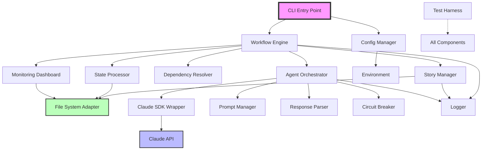

# Components

Based on the architectural patterns, tech stack, and data models, here are the major logical components:

## CLI Entry Point
**Responsibility:** Parse command-line arguments, initialize system, handle graceful shutdown

**Key Interfaces:**
- `bmad-automator start` - Begin automation with optional flags
- `bmad-automator status` - Check current automation state
- `bmad-automator stop` - Graceful shutdown
- `--dry-run` - Preview actions without execution
- `--config <path>` - Custom configuration file

**Dependencies:** Commander.js, ConfigManager, WorkflowEngine

**Technology Stack:** TypeScript, Commander.js 14.0.0, Node.js 22.11.0

## Workflow Engine
**Responsibility:** Orchestrate story processing flow, manage state transitions, enforce sequential processing

**Key Interfaces:**
- `startAutomation(): Promise<void>` - Main automation loop
- `processNextStory(): Promise<StoryResult>` - Get and process next story
- `handleStoryCompletion(story: Story): void` - Update state after completion
- `checkEpicCompletion(): Promise<boolean>` - Verify if all epics done

**Dependencies:** StoryManager, StateProcessor, DependencyResolver, AgentOrchestrator

**Technology Stack:** TypeScript with event emitters for state changes, async/await patterns

## Story Manager
**Responsibility:** Discover story files, parse YAML frontmatter, manage story lifecycle

**Key Interfaces:**
- `discoverStories(): Promise<Story[]>` - Scan docs/stories directory
- `parseStoryFile(path: string): Promise<Story>` - Extract structured data
- `updateStoryFile(story: Story): Promise<void>` - Write changes back
- `validateStory(story: Story): ValidationResult` - Ensure story integrity

**Dependencies:** FileSystemAdapter, YAMLParser, StoryValidator

**Technology Stack:** TypeScript, Chokidar 3.6.0 for file watching, custom YAML parser

## State Processor
**Responsibility:** Manage stories.json, enforce state machine rules, track execution order

**Key Interfaces:**
- `loadState(): Promise<StoriesJson>` - Read current state
- `saveState(state: StoriesJson): Promise<void>` - Atomic write with backup
- `transitionStory(story: string, newStatus: StoryStatus): void` - State change
- `getNextStory(): Story | null` - Priority-based selection

**Dependencies:** FileSystemAdapter, StateValidator, AtomicFileWriter

**Technology Stack:** TypeScript, Zod 4.0.14 for validation, atomic file operations

## Dependency Resolver
**Responsibility:** Build dependency graph, detect circular dependencies, determine execution order

**Key Interfaces:**
- `buildDependencyGraph(stories: Story[]): DependencyGraph` - Create graph
- `detectCycles(): string[][]` - Find circular dependencies
- `getExecutionOrder(): string[]` - Topological sort
- `canExecute(story: Story): boolean` - Check if dependencies met

**Dependencies:** Graph algorithms library (internal)

**Technology Stack:** TypeScript, custom graph implementation

## Agent Orchestrator
**Responsibility:** Manage Claude SDK interactions, route stories to appropriate agents, handle retries

**Key Interfaces:**
- `sendToAgent(story: Story, agentType: AgentType): Promise<AgentResponse>`
- `parseAgentResponse(response: string): ParsedResponse`
- `retryWithBackoff(fn: Function): Promise<any>`
- `getAgentPrompt(story: Story, agent: AgentType): string`

**Dependencies:** ClaudeSDKWrapper, PromptManager, ResponseParser, CircuitBreaker

**Technology Stack:** TypeScript, @anthropic-ai/sdk 0.57.0

## Claude SDK Wrapper
**Responsibility:** Abstract Claude API interactions, manage conversations, handle streaming

**Key Interfaces:**
- `createConversation(): Conversation` - New agent session
- `sendMessage(prompt: string): Promise<Response>` - Send to Claude
- `streamResponse(onChunk: Function): void` - Handle streaming
- `handleRateLimit(): void` - Backoff strategy

**Dependencies:** @anthropic-ai/sdk

**Technology Stack:** TypeScript, official Anthropic SDK with custom error handling

## Prompt Manager
**Responsibility:** Generate agent-specific prompts, inject story context, ensure parseable responses

**Key Interfaces:**
- `getPromptTemplate(agent: AgentType): PromptTemplate`
- `buildPrompt(template: PromptTemplate, story: Story): string`
- `injectResponseFormat(prompt: string): string` - Add format requirements
- `addTDDRequirements(prompt: string): string` - Enforce TDD

**Dependencies:** Template engine (internal)

**Technology Stack:** TypeScript, template literals with validation

## Response Parser
**Responsibility:** Extract structured data from agent responses, handle malformed responses

**Key Interfaces:**
- `parseStatus(response: string): StoryStatus | null`
- `parseSignature(response: string): AgentSignature | null`
- `parseFindings(response: string): Finding[]`
- `fallbackParse(response: string): ParsedResponse` - Regex fallback

**Dependencies:** Natural language parsing utilities

**Technology Stack:** TypeScript, multiple parsing strategies

## File System Adapter
**Responsibility:** Abstract file operations, ensure atomic writes, manage locks

**Key Interfaces:**
- `readFile(path: string): Promise<string>`
- `writeFileAtomic(path: string, content: string): Promise<void>`
- `watchDirectory(path: string, callback: Function): void`
- `acquireLock(file: string): Promise<Lock>`

**Dependencies:** Node.js fs, Chokidar

**Technology Stack:** TypeScript, Node.js fs.promises, lock files

## Logger
**Responsibility:** Structured logging, log rotation, performance metrics

**Key Interfaces:**
- `info(message: string, meta?: object): void`
- `error(error: Error, context?: object): void`
- `metric(name: string, value: number): void`
- `createChildLogger(context: object): Logger`

**Dependencies:** Winston

**Technology Stack:** Winston 3.17.0 with JSON format, daily rotation

## Configuration Manager
**Responsibility:** Load configuration, manage environment variables, validate settings

**Key Interfaces:**
- `loadConfig(path?: string): Config`
- `validateConfig(config: unknown): Config`
- `getApiKey(): string` - Secure retrieval
- `getFeatureFlags(): FeatureFlags`

**Dependencies:** Zod, dotenv

**Technology Stack:** TypeScript, Zod validation, environment variables

## Test Harness
**Responsibility:** Provide comprehensive testing utilities for TDD approach

**Key Interfaces:**
- `mockClaudeResponse(response: string): void`
- `createTestStory(overrides?: Partial<Story>): Story`
- `runIntegrationTest(scenario: TestScenario): TestResult`
- `generateCoverageReport(): CoverageReport`

**Dependencies:** Jest, jest-mock-extended

**Technology Stack:** Jest 30.0.5, ts-jest, mock adapters

## Circuit Breaker
**Responsibility:** Prevent cascade failures, implement retry logic, handle backoff

**Key Interfaces:**
- `protect<T>(fn: () => Promise<T>): Promise<T>` - Wrap calls
- `trip(): void` - Open circuit
- `reset(): void` - Close circuit
- `getState(): CircuitState` - Current state

**Dependencies:** None (self-contained)

**Technology Stack:** TypeScript, exponential backoff algorithm

## Monitoring Dashboard Generator
**Responsibility:** Create morning summary reports, track metrics, visualize progress

**Key Interfaces:**
- `generateDailyReport(): Report` - Morning summary
- `trackStoryCompletion(story: Story): void` - Metrics
- `exportHTML(): string` - Visual dashboard
- `calculateVelocity(): number` - Stories/day

**Dependencies:** Template engine, date-fns

**Technology Stack:** TypeScript, HTML templates, date-fns 3.6.0

## Component Interaction Diagram

