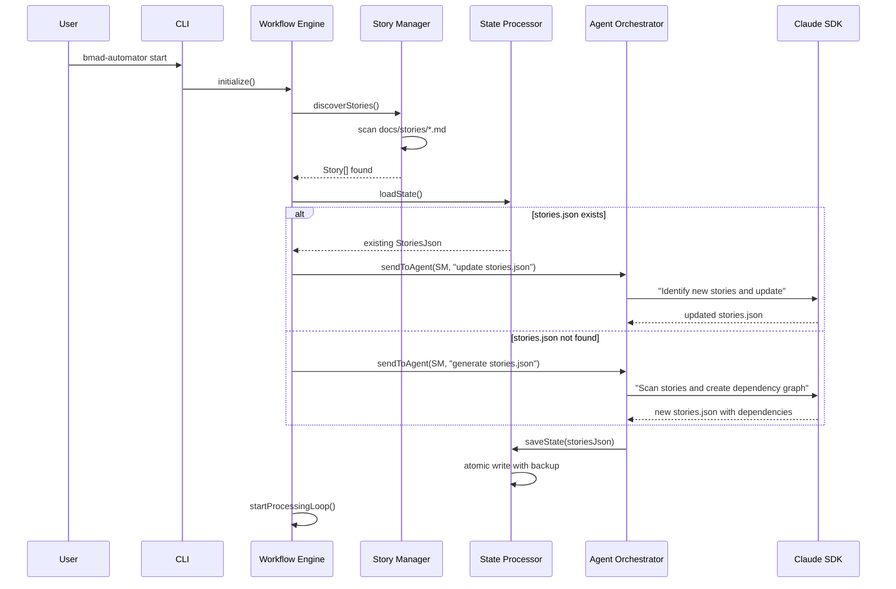
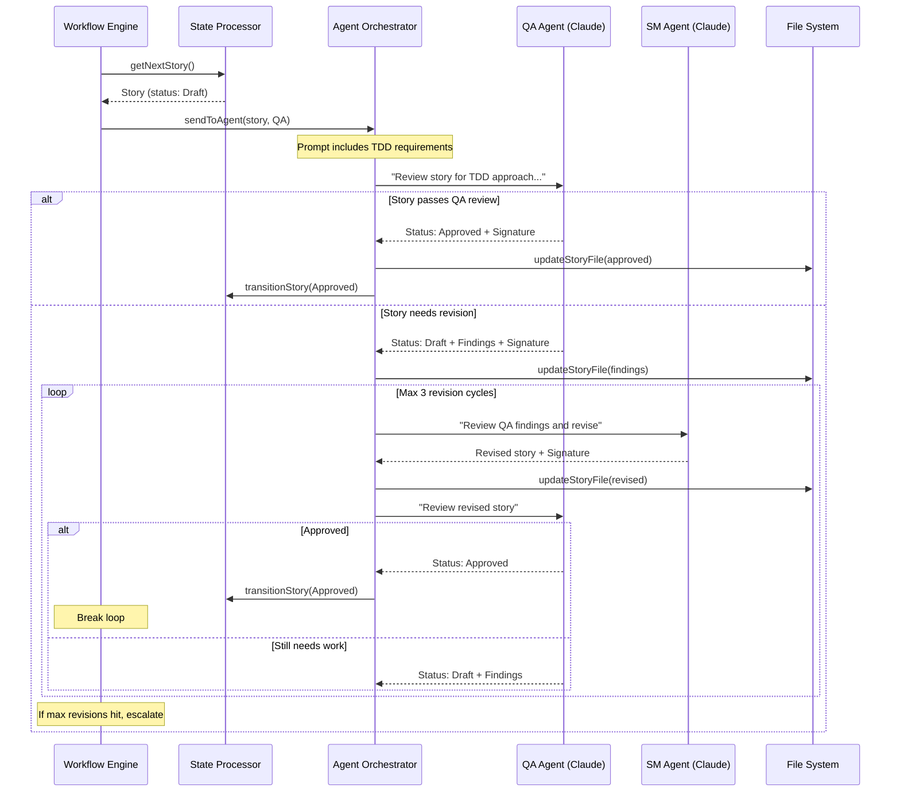
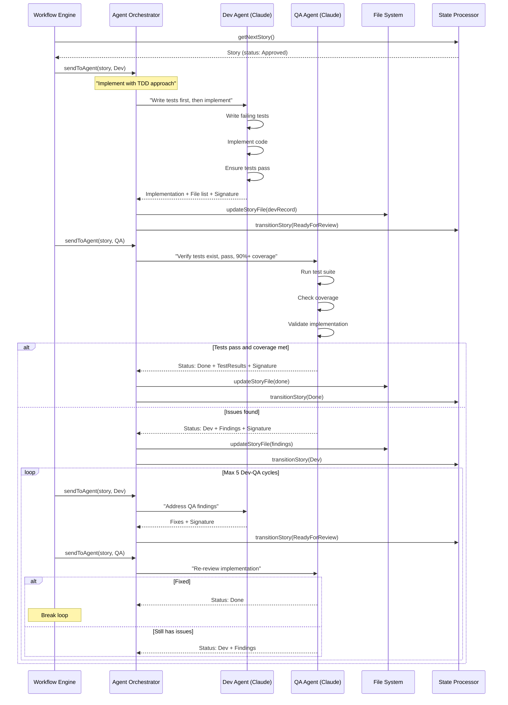
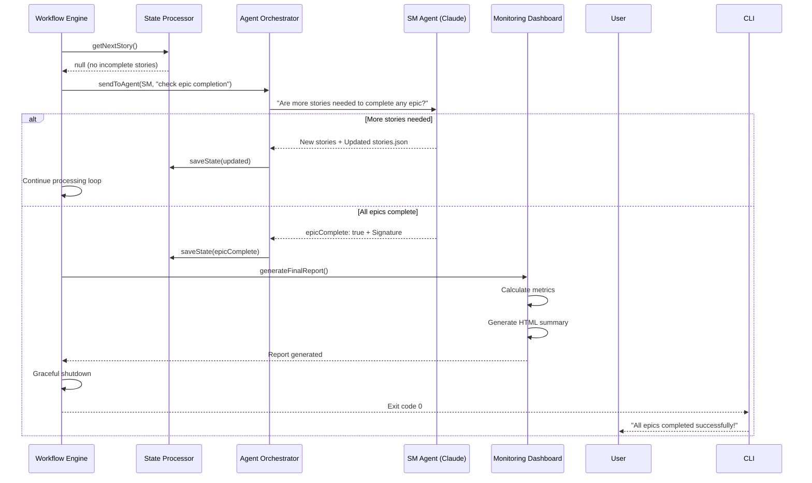
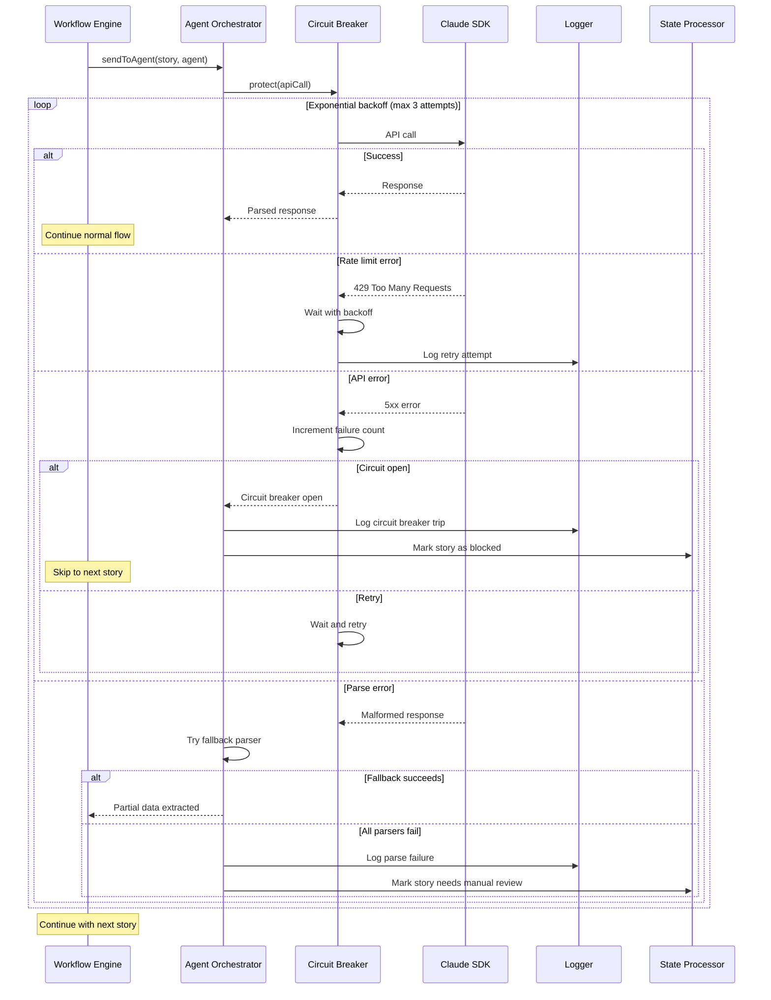

# Core Workflows

These sequence diagrams illustrate the key system workflows for the BMad CLI Automation Tool:

## 1. System Initialization and Story Discovery

## 2. Story Approval Workflow (Draft → Approved)

## 3. Development and Testing Workflow (Approved → Done)

## 4. Epic Completion Detection Workflow

## 5. Error Recovery Workflow

