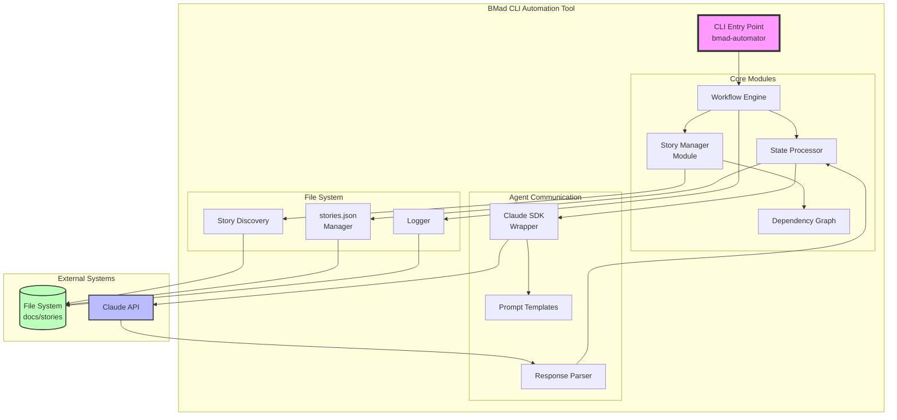

# High Level Architecture

## Technical Summary

The BMad CLI Automation Tool employs a monolithic event-driven architecture built on TypeScript and Node.js, orchestrating Claude AI agents through the TypeScript SDK to achieve 24/7 autonomous development. The system uses a state machine pattern to manage story lifecycle transitions, with file-based state persistence via stories.json serving as the single source of truth. Core architectural patterns include dependency injection for testability, repository pattern for file system abstraction, and circuit breakers for resilient agent communication. This architecture directly supports the PRD goals of reducing manual orchestration from 3+ hours to <10 minutes daily while maintaining strict TDD practices with 90% test coverage.

## High Level Overview

1. **Main Architectural Style**: Monolithic CLI Application with Event-Driven internals
   - Single Node.js process orchestrating all operations
   - Event emitters for workflow state changes
   - Plugin-based architecture for future extensibility

2. **Repository Structure**: Monorepo (as specified in PRD)
   - Single repository containing all code
   - NPX-distributable package structure
   - Shared TypeScript configurations

3. **Service Architecture**: Monolithic with Domain-Driven modules
   - Core domain: Story lifecycle management
   - Agent communication module
   - File system operations module
   - State management module

4. **Primary Data Flow**:
   - Stories discovered from `docs/stories` directory
   - State machine processes stories by priority (Ready For Review → Dev → Approved → Draft)
   - Claude SDK facilitates agent interactions
   - stories.json persists state between runs
   - Graceful exit when all epics complete

5. **Key Architectural Decisions**:
   - **File-based state over database**: Simplifies deployment and aligns with developer workflows
   - **Sequential processing**: Ensures focus and prevents context switching for AI agents
   - **Event-driven internals**: Enables future parallel processing without major refactoring
   - **TypeScript SDK over CLI**: Better error handling and streaming responses

## High Level Project Diagram

## Architectural and Design Patterns

- **State Machine Pattern:** Managing story lifecycle transitions (Draft → Approved → Dev → Ready For Review → Done) - _Rationale:_ Enforces valid state transitions and provides clear workflow boundaries essential for agent handoffs

- **Repository Pattern:** Abstracting file system operations for stories and state persistence - _Rationale:_ Enables comprehensive testing with mock file systems and future migration flexibility

- **Circuit Breaker Pattern:** Protecting against Claude API failures and infinite retry loops - _Rationale:_ Prevents system lockup during API outages and manages retry attempts with exponential backoff

- **Observer Pattern:** Event-driven workflow state changes and progress notifications - _Rationale:_ Decouples workflow steps and enables future parallel processing capabilities

- **Command Pattern:** Encapsulating agent instructions with required parameters - _Rationale:_ Ensures consistent agent communication and enables dry-run testing mode

- **Dependency Injection:** Wiring components with interfaces rather than concrete implementations - _Rationale:_ Critical for achieving 90% test coverage requirement through comprehensive mocking

- **Template Method Pattern:** Standardizing agent prompt generation with variable substitution - _Rationale:_ Maintains consistency across agent types while allowing customization
